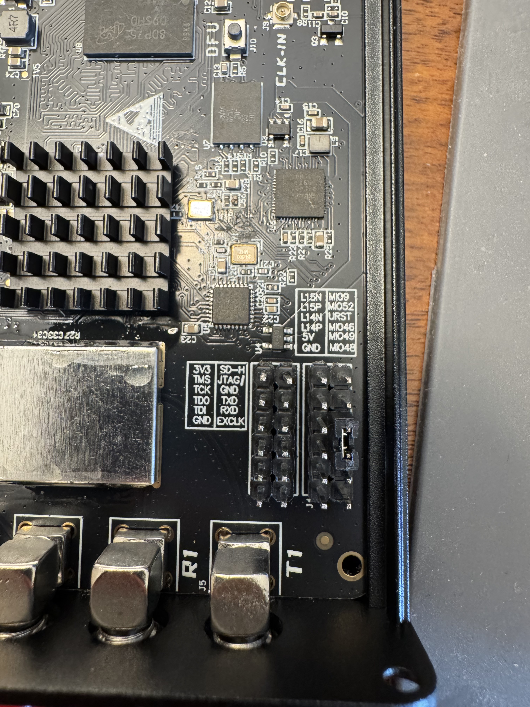

# Pluto+ Software Defined Radio

The hardware was purchased from [HamGeek](https://www.hgeek.com/products/pluto-sdr-transceiver-radio-70mhz-6ghz-software-defined-radio-for-ethernet). The hardware received is the "2nd revision", as can be seen from the presence of "3V3" (as opposed to "1V8" for 1st revision units) in the silkscreen for the pin to the left of the "SD-H" pin.



## Loading Firmware
To get the Pluto Plus into its most functional state, HamGeek recommends using the [plutoplus](https://github.com/plutoplus/plutoplus) GitHub repository. This repository instructs one to "download the firmware", then program it to the device. However, there is no download link provided. There are instructions on how to build the firmware, but that task is more difficult than it originally seems. Building the firmware requires installing a specific version of AMD Vivaldo software from 2021 and having a contemporary ARM cross-toolchain to compile the 5-year-old kernel. Additionally, this repository hasn't been updated in 5 years and the built firmware cannot be run from an SD card, only internal storage.

A better alternative to the "official" firmware is [F5OEO's Tezuka](https://github.com/F5OEO/tezuka_fw) firmware. This firmware runs on the Pluto+ Rev2, but requires some special handling to get running from an SD card. As documented in the [plutoplus](https://github.com/plutoplus/plutoplus) repo, two internal pads must be connected to enable booting from the SD card. Also, the internal serial port headers must be populated so that the device can be interacted with over serial.


With the "3V3" and "SD-H" pins bridged and a USB serial interface (FTDI Friend, Tigard, etc) connected to the "Tx", "RX", and "GND" pins, next format the MicroSD card you will use to store the firmware. The SD card must be formatted with an MBR and a single FAT32 partition with type 0xC (Windows 95 FAT). Next, format the new partition as FAT32. Then, download the [latest release](https://github.com/F5OEO/tezuka_fw/releases) of the Tezuka firmware for "plutoplus". Copy the contents of the `sdimg` folder to the root of the SD card's FAT32 partition. Then, remove the SD card and insert it into the SDR.

With the serial console attached (115200 baud), boot up the device by connecting to the **right** MicroUSB port for power. If the system boots up nicely, you're done! That's not what happened for me though; the u-boot environment was not configured properly so I got checksum errors and a never-booting Linux kernel. To fix this, you can follow the instructions in [this issue](https://github.com/F5OEO/tezuka_fw/issues/353#issuecomment-4610142157) on the Tezuka repo. Boot the device, then press a key to break into u-boot's shell. While in the shell, run the following commands:
```
env default -f -a
env save
reset
```

After running `reset`, the device should fully reboot and start properly! Remember to find a permanent way to connect the "3V3" and "SD-H" pins on the device before closing it back up.

## Configuring Static IP address
If your Pluto is being kind, when you connect to the left MicroUSB port (which can also provide power for the SDR), you will be presented with a USB mass storage device containing the file `config.txt`. You can set the `ipaddr_eth`, `netmask_eth` (and optionally `gateway_eth`) values in the `[USB_ETHERNET]` section to configure the network settings for the physical ethernet port on the SDR.

If your Pluto is not being kind, this USB gadget mass storage device may not appear. It's OK though, that `config.txt` file is just how the Pluto presents some of its u-boot environment variables. You can set these values either from the serial console or over SSH by running `fw_setenv $VAR $VALUE` in a Linux shell. When you reboot the system, the physical ethernet port will have the new settings applied.

## Random Notes
- On both the original Pluto firmware and all of the custom firmware, you can SSH into the SDR using the credentials `root`:`analog`.
